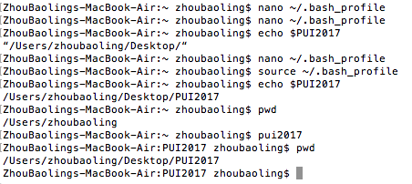
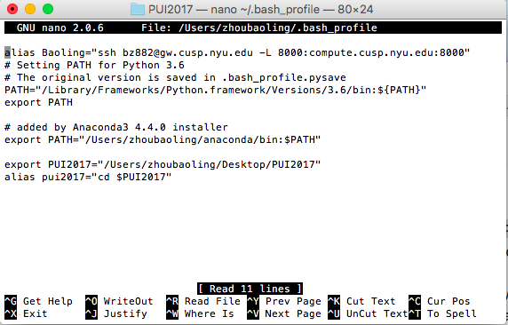

# PUI2017_bz882
#Firstly, I created a file named PUI2017 on my desktop
#Then, I open my bash_file and created an environmental variable named PUI2017.
#I assigned the directory path to this variable
#Next, I assigned command "cd $PUI2017" to the alias pui2017, so that I would 
#be able to go to the directory of PUI2017 by directly execute pui2017

